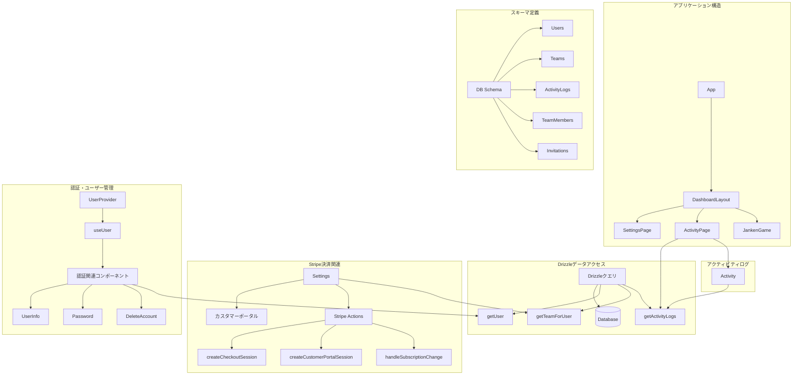

```mermaid
graph TD
    subgraph "アプリケーション構造"
        App --> DashboardLayout
        DashboardLayout --> SettingsPage
        DashboardLayout --> ActivityPage
        DashboardLayout --> JankenGame
    end

    subgraph "認証・ユーザー管理"
        UserProvider --> useUser
        useUser --> AuthComponents[認証関連コンポーネント]
        AuthComponents --> UserInfo
        AuthComponents --> Password
        AuthComponents --> DeleteAccount
    end

    subgraph "Stripe決済関連"
        Settings --> CustomerPortal[カスタマーポータル]
        Settings --> StripeActions[Stripe Actions]
        StripeActions --> createCheckoutSession
        StripeActions --> createCustomerPortalSession
        StripeActions --> handleSubscriptionChange
    end

    subgraph "Drizzleデータアクセス"
        DB[(Database)]
        DrizzleQueries[Drizzleクエリ] --> DB
        DrizzleQueries --> getUser
        DrizzleQueries --> getTeamForUser
        DrizzleQueries --> getActivityLogs
        
        ActivityPage --> getActivityLogs
        Settings --> getTeamForUser
        AuthComponents --> getUser
    end

    subgraph "アクティビティログ"
        Activity --> getActivityLogs
        ActivityPage --> Activity
    end

    subgraph "スキーマ定義"
        Schema[DB Schema] --> Users
        Schema --> Teams
        Schema --> ActivityLogs
        Schema --> TeamMembers
        Schema --> Invitations
    end
```